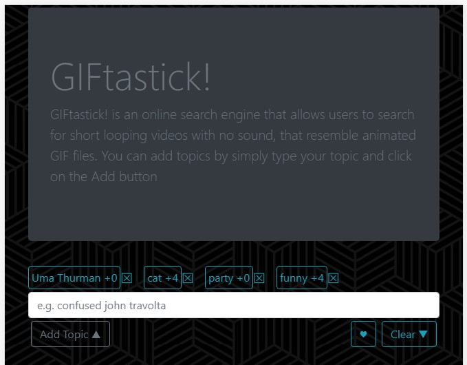
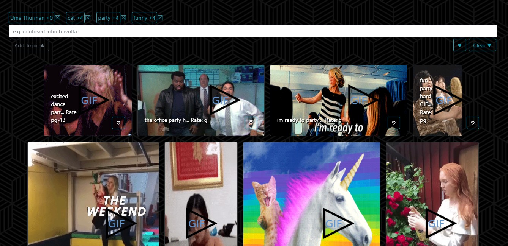

# API-GifTastick

# Assignment: 

In this assignment, we'll use the GIPHY API to make a dynamic web page that populates with gifs of our choice. To finish this task, we must call the GIPHY API and use JavaScript and jQuery to change the HTML of our site.

## Getting Started

* View here: https://haamraah.github.io/API-GifTastick/
* github repository : https://github.com/haamraah/API-GifTastick

## Features
####  - Search Feature
* Give users a handy search tool so that they can find the content they need quickly.
* users can **add** and **remove** topics, topics are **saved** in **localStorage** .
* add topic button is limited to Not add duplicate topic or empty text topic
* each topic shows the numbre of GIFs related on the screen
#### - Less Keyboarding and More Touch
* once user adds the topic , each time user clicks on a topic i'll add maximum of 4 new GIFs to screen
* each time user clicks on a GIF i'll **start or stop** GIF based on actual state
#### - Save Favorite GIFs
* clicking on the ♥ button on each GIF you can **add** to saved GIFs or **remove** from **saved GIFs**
* clicking on the ♥ button on top of the page you will see the saved GIFs , that button also **shows if the saved GIFs is empty**
* **Saved GIFs** are saved on **localStorage**
#### - Responsive Design for Varying Screen Sizes

## Technologies used

* Bootstrap
* jQuery

## Prerequisites

* Bootstrap: visit http://getbootstrap.com/getting-started/ for the CDN and link in html
* jQuery: visit http://code.jquery.com/ and link in html

## Built With

* Sublime Text - Text Editor
* Bootstrap- Wireframe

### Author

Hamrah - HTML/CSS/JS

### Screen Shots

